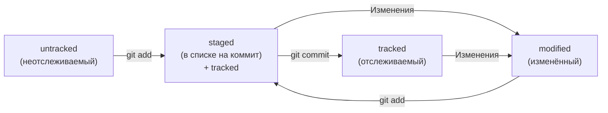

## Git - это система контроля версий 
*помогает отслеживать изменения в программах, текстовых файлах, больших документах, веб-сайтах и пр.*

### Основные команды:
- pwd - показывает рабочую директорию
- cd - смена директории
- ls - вывод содержимого директории
- touch - создание файла
- mkdir - создание директории
- cp - копирование 
- mv - перемещение
- cat - чтение файлов
- rm - удаление 

### Работа с репозиторием:

- git status - состояние репозитория
- git add - добавить файлы в репозиторий
- git commit -m - выполнить коммит
- git log - история коммитов
- git push - отправить файлы из локального хранилища на удаленное

### Основные понятия 

**Хэш** - идентификатор коммита (при вызове команды  git log)
*Обычно хеш — это короткая (40 символов в случае SHA-1) строка, которая состоит из цифр 0—9 и латинских букв A—F*

**Лог** - cписок комминтов (при вызове команды  git log)
*Элементы, из которых состоит описание:
- строка из цифр и латинских букв после слова commit — это хеш коммита;
- Author — имя автора и его электронная почта;
- Date — дата и время создания коммита;
- в конце находится сообщение коммита.*

**Сокращенный лог** - cписок только первых нескольких символов хеша (сокращенный хэш) каждого коммита и их комментарии (при вызове команды git log --oneline)

**HEAD** — один из служебных файлов папки .git
*Он указывает на коммит, который сделан последним (то есть на самый новый)*

### Статусы файлов в Git

- untracked  - файл добавлен (Git знает, но не следит за изменениями в нём)
- staged + tracked - после выполнения git add
- modified (+untracked/tracked) - файл был изменен
- tracked  - файл закоммичен

[Мой проект на GitHub](https://github.com/dasha-omely/second-project-dasha)

---

##### Спасибо за внимание!
